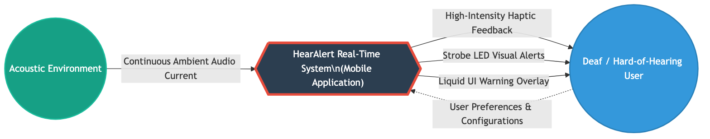
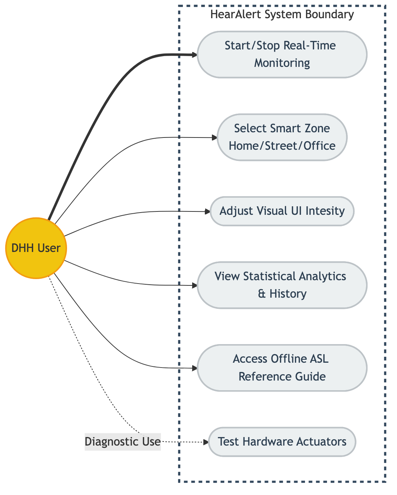
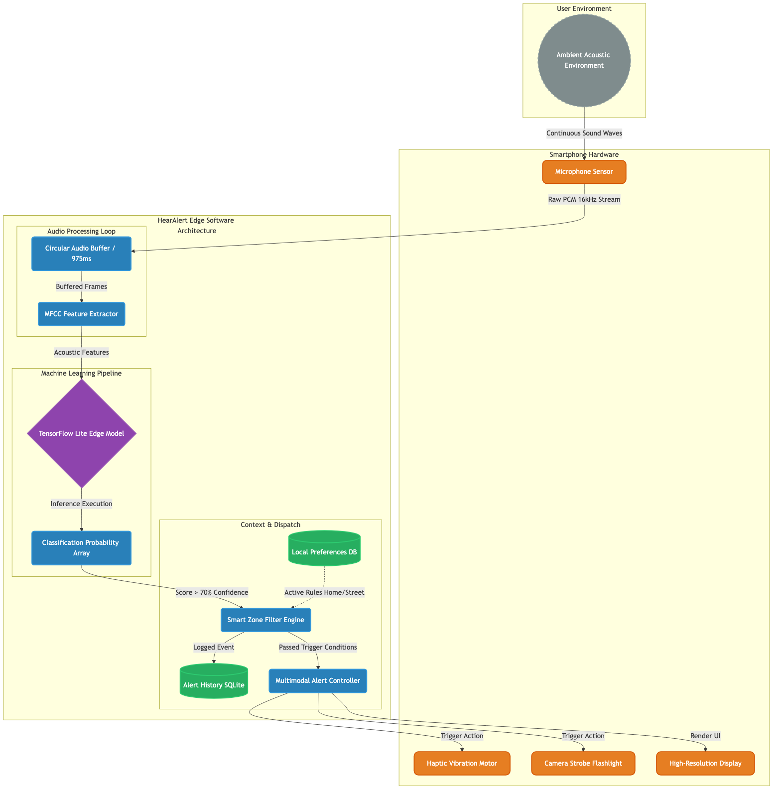

# First Review Report: HearAlert
**AI-Powered Environmental Awareness for the Deaf and Hard-of-Hearing**

---

## 1. Introduction

For individuals who are deaf or hard-of-hearing (DHH), navigating a world dominated by auditory cues—such as emergency sirens, fire alarms, and honking vehicles—presents continuous challenges and safety risks. 

**HearAlert** is an AI-powered mobile application designed to bridge this crucial sensory gap. By leveraging real-time machine learning (ML) audio classification through on-device processing, HearAlert acts as a continuous "digital ear." When a critical sound is detected, the app instantaneously translates the audio event into multi-sensory physical alerts, including customized haptic vibration patterns and high-visibility camera strobe flashes, ensuring the physical safety and independence of the user.

---

## 2. Problem Statement and Objectives

### Problem Statement
Over 430 million people worldwide experience disabling hearing loss. Current assistive technologies meant to alert these individuals to acoustic dangers rely heavily on static, specialized hardware (e.g., hardwired strobe fire alarms) that are prohibitively expensive and offer no protection outside the home. Meanwhile, software-based solutions that rely on cloud servers suffer from severe latency and fail in areas without Wi-Fi or cellular networks, making them unreliable for life-or-death emergencies. There is an urgent need for an accessible, portable, offline software solution utilizing ubiquitous hardware (smartphones).

### Objectives
1.  **Ultra-Low-Latency Edge Processing:** To implement a lightweight audio ingestion engine across an on-device neural network (TensorFlow Lite), processing audio with near-zero latency without internet reliance.
2.  **High-Precision AI Classification:** To deploy a dual-model Artificial Intelligence pipeline capable of hyper-accurate classification of critical safety sounds (Fire Alarms, Sirens, Car Horns, Baby Crying, Glass Breaking).
3.  **Context-Aware Filtering (Smart Zoning):** To dynamically suppress irrelevant alerts based on the user's situation (e.g., suppressing traffic noise while in 'Home Mode') to prevent alert fatigue.
4.  **Multi-Sensory Dispatching:** To translate AI inferences into immediate physical actions: mapping distinct vibration patterns and visual LED strobes that are WCAG 2.1 AA compliant.

---

## 3. Scope and System Requirements

### Existing System Disadvantages vs Proposed System
| Feature | Existing Systems | Proposed System (HearAlert) |
| :--- | :--- | :--- |
| **Hardware** | Requires custom vibration pads / wired strobes | Software-only; uses user's existing smartphone |
| **Portability** | Confined to a single room | 100% portable; protects users everywhere |
| **Processing** | Cloud APIs (high latency, breaks offline) | Edge Computing processing locally |

### Key Performance Metrics (KPIs)
*   **End-to-End Latency:** < 1000ms from physical sound to hardware vibration.
*   **Model F1-Score:** > 85% accuracy for Critical Safety sounds to minimize false negatives.
*   **False Positive Rate:** < 5% during ambient noise to prevent alert fatigue.

---

## 4. Initial System Design & Architecture

### 4.1 Data Flow Diagram (Context Level)

The Level 0 Data Flow Diagram depicts the fundamental concept of HearAlert: the app acts as a sensory bridge, ingesting standard real-world acoustic waves and dispatching translated physical haptic and visual signals directly to the user.

### 4.2 UML Use Case Diagram

The Use Case models the primary interactions. The DHH user initializes the microphone monitoring, sets their preferred sensory outputs (haptic intensity/strobes), establishes their Smart Zone context, and reviews historical analytics.

### 4.3 System Architecture Diagram

HearAlert utilizes a **Pipes-and-Filters Edge Architecture**. Raw hardware microphone streams are pushed into a temporary buffer. This buffer is read by a dual-stage neural network (leveraging YAMNet) on the Mobile Processor. Validated results that pass the confidence gateway are immediately pushed to the Alert Hardware engine to trigger the device's vibration motors.
