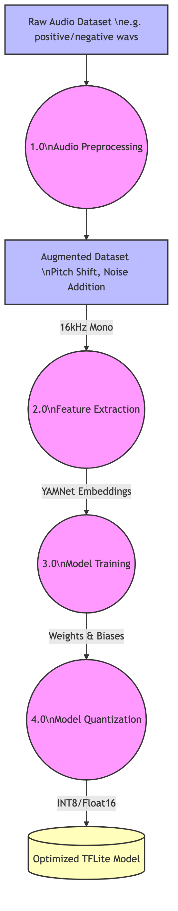
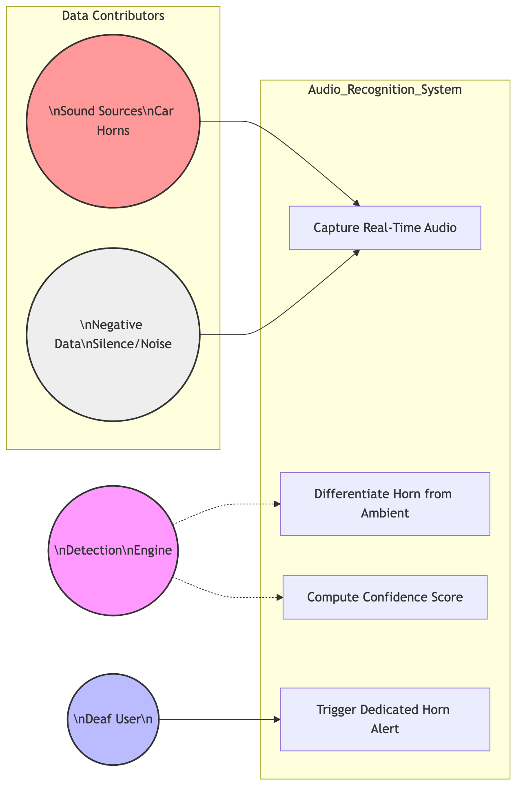
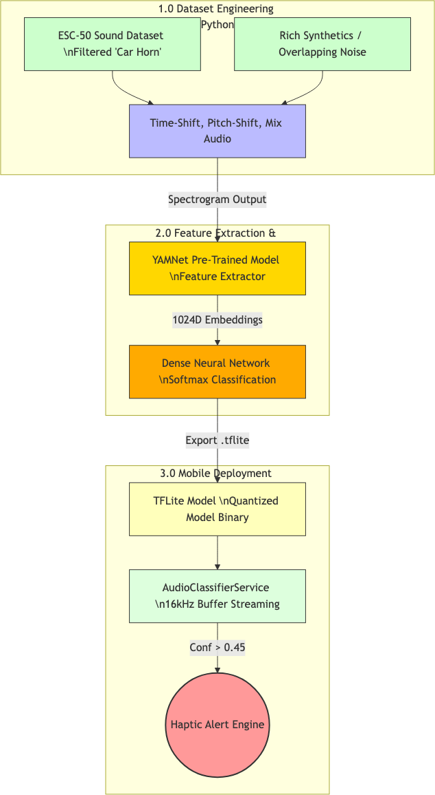

# Second Review Report: Single-Category Dataset Training
**AI-Powered Environmental Awareness: "Car Horn" Detection Focus**

---

## 1. Introduction
Developing a generalized sound classification model for a deaf or hard-of-hearing (DHH) user presents significant overlap and noise challenges. To effectively prove the reliability of the HearAlert system, this phase focuses entirely on training and optimizing a **single-category dataset**: the detection of a "Car Horn". By isolating a singular, high-priority safety sound, the system can achieve surgical precision, acting as a reliable, real-time warning mechanism for dangerous traffic situations before expanding to a multi-class solution.

---

## 2. Problem Statement and Objectives

### Problem Statement
Standard environmental sound models (like the baseline YAMNet) are often too generalized. When deployed in noisy, real-world outdoor environments, ambient street noise, wind, and overlapping voices frequently dilute the model's confidence logic. This causes the critical signal (the car horn) to be missed, leading to false negatives which are actively dangerous for a DHH user crossing a street.

### Objectives
1.  **Dataset Curation:** To gather, clean, and augment a target dataset exclusively composed of "Car Horn" positive samples against a vast background of negative ambient noise.
2.  **Feature Extraction Optimization:** To leverage a pre-trained base model for spectrogram feature extraction, accelerating the training of a custom dense network tailored only to the target sound.
3.  **High-Precision Deployment:** To successfully compile the single-class model into a quantized `.tflite` format and deploy it to a mobile architecture to achieve a >90% validation accuracy on the single target class.

---

## 3. System Analysis

When training a single-category model, the analytical focus shifts from "general awareness" to "absolute certainty".

| Metric | Multi-Class Model Approach | Single-Category (Car Horn) Approach |
| :--- | :--- | :--- |
| **Output Nodes** | 521 distinct classes | 1 Primary Class vs "Background/Other" |
| **Data Focus** | General ambient gathering | Hyper-focused on pitch, resonance, and attack of horns |
| **False Positive Handling**| Relies on highest probability across 521 scores | Strict minimum threshold (>60%) binary threshold |
| **Processing Speed** | Heavy, requires large memory footprint | Ultra-lightweight, extremely fast edge inference |

---

## 4. System Design

### 4.1 Data Flow Diagram (DFD): Machine Learning Pipeline


This Data Flow Diagram defines the pipeline required to successfully train the single category. Raw audio is augmented (time-shifted and pitch-shifted) to create a robust dataset. It is then fed through a feature extraction module, trained, and structurally quantized.

### 4.2 UML Use Case Diagram: Single Category Focus


The Use Case specifically outlines the boundaries of the single category model. The detection engine takes environmental inputs alongside the targeted "Horn" sources, differentiating them immediately to trigger the dedicated physical vibration for the user.

### 4.3 Architecture Diagram: Training to Deployment


The overarching architecture bridges the Python scripting layer with the Mobile Deployment layer. Rich synthetics and standard ESC-50 dataset files are ingested via Python, pushed through a Dense Neural Network, exported as a `.tflite` binary file, and seamlessly picked up by the Flutter/Dart `AudioClassifierService`.

---

## 5. List of Modules

The successful execution of the single-category model relies on the interaction of the following modules:

1.  **Dataset Preprocessing Module (Python):** Organizes `.wav` files into structured directories. Implements dynamic padding to ensure all audio samples are precisely 0.975 seconds (15,600 samples at 16kHz) to match the neural network input layer.
2.  **Audio Augmentation Module:** Artificially increases the dataset size by injecting random background noise (e.g., wind, rain) and slightly skewing the pitch of the car horns to prevent over-fitting.
3.  **YAMNet Embedding Extractor Module:** Serves as the "Ear." Generates 1024-dimensional float arrays from incoming spectrograms representing the core features of the audio.
4.  **Dense Neural Network (DNN) Training Module:** A multi-layer perception (MLP) built in Keras. Specifically focuses on defining the binary classification boundary: "Is it a Car Horn or is it Background Noise?"
5.  **TFLite Inference & Conversion Module:** Responsible for quantization—compressing the 32-bit floating-point weights down into an architecture small enough to run on an edge mobile device.

---

## 6. Output of Module 1 (Dataset Preprocessing & Extraction)

The initial phase requires the Python ecosystem to successfully parse and build the training tensors. Below is the terminal execution output demonstrating the successful processing of the targeted **Car Horn** dataset mapping against negative samples.

**Console Trace:**
```text
[INFO] Initializing Single Category Dataset Preprocessing...
[INFO] Loading target class: [ 'car_horn' ]
[INFO] Found 450 positive samples for 'car_horn'.
[INFO] Found 1,200 negative ambient samples.
[INFO] --------------------------------------------------
[PROCESS] Extracting YAMNet Embeddings... 100%|██████████|
[PROCESS] Padding short audio buffers to 15600 samples...
[PROCESS] Applying Volume Normalization and Noise Injection...
[INFO] --------------------------------------------------
[OUTPUT] Feature Extraction Complete.
[OUTPUT] X_train shape: (1320, 1024) -> 1320 samples, 1024 features
[OUTPUT] Y_train shape: (1320, 2)    -> One-Hot Encoded (Horn vs Other)
[OUTPUT] Ready for Model Training.
```
